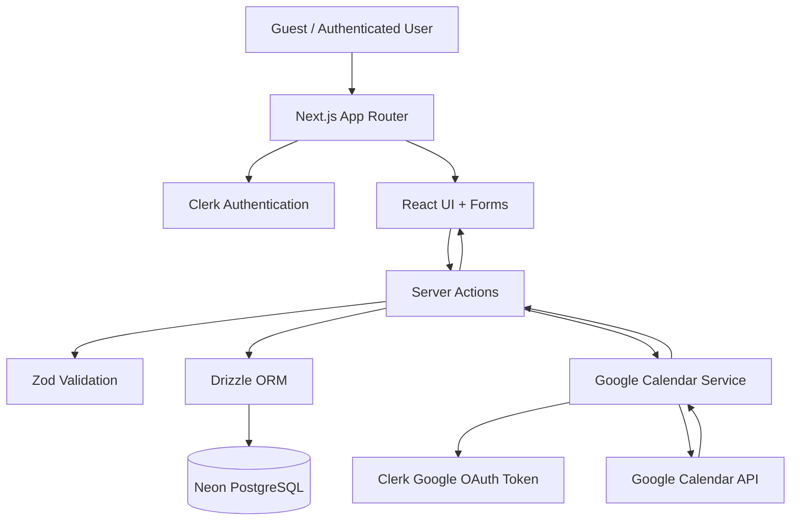
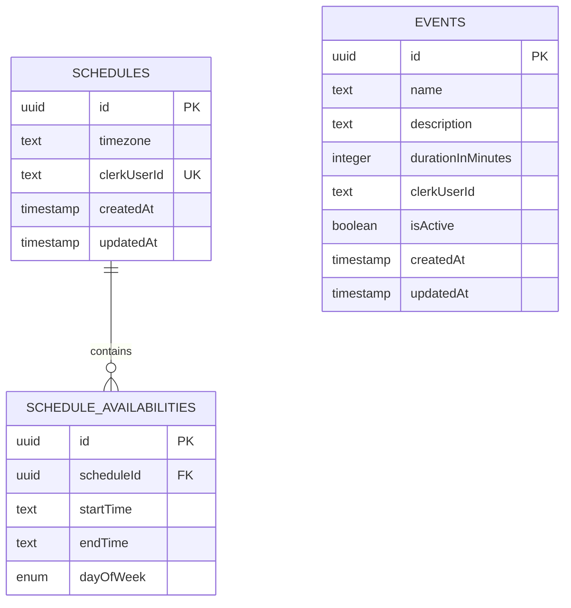
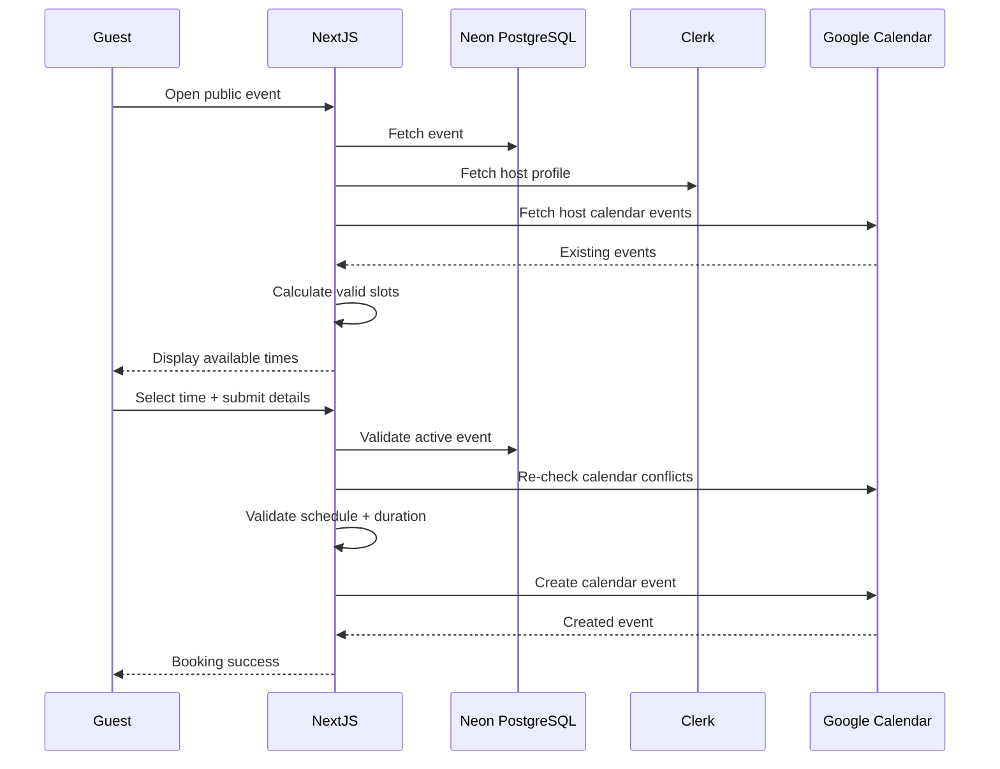

# ⏰ Chrona

> **Your Time, Perfectly Planned.**

Chrona is a modern, full-stack scheduling and meeting-booking application inspired by tools like Calendly. It lets users create shareable event types, define their availability, connect Google Calendar, and allow guests to book available time slots without scheduling conflicts.

Built with **Next.js 16, React 19, TypeScript, Clerk, Neon PostgreSQL, Drizzle ORM, Zod, and the Google Calendar API**.

---

## ✨ What is Chrona?

Chrona solves a simple but common problem:

**"When are you actually free for a meeting?"**

Instead of manually comparing calendars and negotiating times, a Chrona user can:

1. Create an event type such as **30 Minute Meeting**.
2. Define the days and hours when they are available.
3. Share a public booking URL.
4. Let guests choose an available date and time.
5. Collect the guest's name, email, and optional notes.
6. Automatically create the meeting in the user's Google Calendar.
7. Send calendar updates to the participants through Google Calendar.

The application also takes the user's **timezone** and existing Google Calendar events into account when calculating available slots.

---

## 🚀 Core Features

### 👤 Authentication

Powered by **Clerk**.

- Sign up / registration
- Login
- Protected application pages
- User session handling
- Clerk user profile
- Google OAuth access through Clerk for Calendar integration

---

### 📅 Event Types

Authenticated users can create and manage reusable event types.

Each event can contain:

- Event name
- Description
- Duration
- Active/inactive status

Examples:

```text
30 Minute Meeting
60 Minute Consultation
Project Discussion
Interview
Demo Call
```

Users can:

- Create events
- Edit events
- Delete events
- Activate/deactivate events
- View all their events

---

### 🕐 Availability & Scheduling

Users can configure their weekly availability.

For each day, multiple availability windows can be defined.

Example:

```text
Monday
  09:00 - 12:00
  14:00 - 17:00

Tuesday
  10:00 - 18:00

Wednesday
  Unavailable
```

The schedule system also supports:

- Timezone selection
- Multiple availability ranges per day
- Overlap validation
- Start/end time validation
- Dynamic availability editing

---

### 🌎 Timezone-Aware Booking

Chrona treats timezone handling as a first-class part of scheduling.

The user's schedule stores a timezone, and booking times are converted using `date-fns-tz`.

This allows the application to reason about:

```text
User's configured timezone
        ↓
Availability windows
        ↓
Requested booking date/time
        ↓
Existing Google Calendar events
        ↓
Final available slots
```

---

### 🗓️ Google Calendar Integration

Chrona integrates with Google Calendar through the Google APIs.

It can:

- Read existing calendar events
- Detect scheduling conflicts
- Exclude occupied time slots
- Create new calendar events
- Add the guest as an attendee
- Add the host as an attendee
- Include optional guest notes
- Send calendar updates to participants

This means the public booking page only exposes times that are actually available according to both the user's configured schedule and their existing Google Calendar.

---

### 🔗 Shareable Booking Pages

Every user can expose their active events through a public URL.

The routing structure is:

```text
/book/[clerkUserId]
/book/[clerkUserId]/[eventId]
```

A guest can visit an event's public booking page, select an available slot, enter their details, and confirm the meeting.

---

### ✅ Booking Validation

Chrona does not blindly trust the selected time.

Before creating a meeting, the server validates:

- Event exists
- Event is active
- Event belongs to the requested host
- Meeting data is valid
- Selected time is still available
- Selected time falls inside the host's configured availability
- Selected time does not overlap an existing Google Calendar event

This server-side validation is important because availability can change between the moment a page loads and the moment a guest submits the booking.

---

## 🧱 Tech Stack

| Technology | Purpose |
|---|---|
| **Next.js 16** | Full-stack React framework |
| **React 19** | UI |
| **TypeScript** | Type-safe development |
| **Clerk** | Authentication & user identity |
| **Neon PostgreSQL** | Serverless PostgreSQL database |
| **Drizzle ORM** | Database access & schema |
| **Zod** | Runtime validation |
| **React Hook Form** | Form state management |
| **date-fns** | Date/time calculations |
| **date-fns-tz** | Timezone conversion |
| **Google APIs** | Google Calendar integration |
| **Tailwind CSS 4** | Styling |
| **shadcn/ui + Radix UI** | UI components |
| **Lucide React** | Icons |
| **Sonner** | Toast notifications |

---

# 🏗️ Architecture

At a high level, Chrona follows this flow:



---

# 📂 Project Structure

```text
Calendly-main/
│
├── app/
│   ├── (auth)/
│   │   ├── login/
│   │   │   └── [[...login]]/
│   │   └── register/
│   │       └── [[...register]]/
│   │
│   ├── (main)/
│   │   ├── book/
│   │   │   ├── [clerkUserId]/
│   │   │   │   ├── [eventId]/
│   │   │   │   │   ├── page.tsx
│   │   │   │   │   └── success/
│   │   │   │   └── page.tsx
│   │   │   └── page.tsx
│   │   │
│   │   ├── events/
│   │   │   ├── [eventId]/
│   │   │   │   └── edit/
│   │   │   ├── new/
│   │   │   └── page.tsx
│   │   │
│   │   ├── schedule/
│   │   │   └── page.tsx
│   │   │
│   │   └── layout.tsx
│   │
│   ├── globals.css
│   ├── layout.tsx
│   └── page.tsx
│
├── components/
│   ├── forms/
│   │   ├── EventForm.tsx
│   │   ├── MeetingForm.tsx
│   │   └── ScheduleForm.tsx
│   │
│   ├── cards/
│   │   └── EventCard.tsx
│   │
│   ├── ui/
│   │   ├── button.tsx
│   │   ├── calendar.tsx
│   │   ├── card.tsx
│   │   ├── form.tsx
│   │   ├── input.tsx
│   │   ├── select.tsx
│   │   ├── switch.tsx
│   │   └── ...
│   │
│   ├── Booking.tsx
│   ├── LandingPage.tsx
│   ├── NoTimeSlots.tsx
│   ├── PrivateNavBar.tsx
│   ├── PublicEventCard.tsx
│   ├── PublicNavBar.tsx
│   └── PublicProfile.tsx
│
├── constants/
│   └── index.ts
│
├── drizzle/
│   ├── db.ts
│   └── schema.ts
│
├── lib/
│   ├── formatters.ts
│   └── utils.ts
│
├── schema/
│   ├── events.ts
│   ├── meetings.ts
│   └── schedule.ts
│
├── server/
│   ├── actions/
│   │   ├── events.ts
│   │   ├── meetings.ts
│   │   └── schedule.ts
│   │
│   └── google/
│       └── googleCalendar.ts
│
├── public/
│   └── assets/
│
├── drizzle.config.ts
├── next.config.ts
├── proxy.ts
├── package.json
├── tsconfig.json
└── ...
```

---

# 🔄 Application Flow

## 1. User Authentication

The user signs in through Clerk.

```text
User
 ↓
Clerk
 ↓
Authenticated session
 ↓
Chrona dashboard
```

The application uses Clerk's server-side authentication APIs to identify the current user.

Protected pages verify the authenticated user's Clerk ID before accessing private data.

---

## 2. Creating an Event

The event creation flow is:

```text
EventForm
   ↓
React Hook Form
   ↓
Zod validation
   ↓
createEvent()
   ↓
Clerk auth()
   ↓
Drizzle ORM
   ↓
Neon PostgreSQL
```

The event is associated with the authenticated user's `clerkUserId`.

---

## 3. Configuring Availability

The schedule form lets the user define:

- Timezone
- Day of week
- Start time
- End time
- Multiple windows per day

Before saving, Zod validates the schedule.

For example, this is rejected:

```text
09:00 - 13:00
12:00 - 15:00
```

because the two ranges overlap.

This is also rejected:

```text
17:00 - 09:00
```

because the end time must be after the start time.

---

# 🧮 How Available Slots Are Calculated

This is one of the most important parts of the project.

Chrona generates candidate times at **15-minute intervals**, then filters those candidates against the user's schedule and Google Calendar.

Conceptually:

```text
Candidate Time
      │
      ▼
Inside configured availability?
      │
      ├── No ──> Reject
      │
      ▼
Overlaps Google Calendar event?
      │
      ├── Yes ──> Reject
      │
      ▼
Event duration fits inside availability?
      │
      ├── No ──> Reject
      │
      ▼
     ✅ Valid Slot
```

The core logic lives in:

```text
server/actions/schedule.ts
```

The `getValidTimesFromSchedule()` function combines:

- User schedule
- Timezone conversion
- Event duration
- Existing Google Calendar events
- Interval overlap detection

to produce bookable times.

---

# 📆 Booking a Meeting

When a guest chooses a slot:

```text
Guest selects date/time
        ↓
Guest enters name + email + notes
        ↓
Meeting form validation
        ↓
Server-side validation
        ↓
Check event is active
        ↓
Check selected slot is valid
        ↓
Fetch Google Calendar events
        ↓
Check for conflicts
        ↓
Create Google Calendar event
        ↓
Add host + guest as attendees
        ↓
Google sends calendar updates
```

The main server-side booking logic is implemented in:

```text
server/actions/meetings.ts
```

---

# 🗃️ Database Design

Chrona uses PostgreSQL through Neon and Drizzle ORM.

There are three main tables.

## `events`

Stores reusable meeting/event types.

```text
events
├── id
├── name
├── description
├── durationInMinutes
├── clerkUserId
├── isActive
├── createdAt
└── updatedAt
```

---

## `schedules`

Stores one scheduling configuration per user.

```text
schedules
├── id
├── timezone
├── clerkUserId
├── createdAt
└── updatedAt
```

`clerkUserId` is unique, meaning each user has one main schedule.

---

## `scheduleAvailabilities`

Stores the individual availability windows belonging to a schedule.

```text
scheduleAvailabilities
├── id
├── scheduleId
├── startTime
├── endTime
└── dayOfWeek
```

Relationship:



---

# 🔐 Security & Data Ownership

Chrona uses server-side authentication and ownership checks.

For example, updating an event requires both:

```text
event.id === requested event
AND
event.clerkUserId === authenticated user
```

The same ownership pattern is used for event deletion and updates.

Public booking pages can read only the event information required for booking, and only active events are considered publicly bookable.

---

# 🧪 Validation

Validation is centralized with Zod.

### Event validation

```text
name                → required
description         → optional
isActive            → boolean
durationInMinutes   → positive integer
maximum duration    → 12 hours
```

### Meeting validation

```text
startTime   → future date/time
guestEmail  → valid email
guestName   → required
timezone    → required
guestNotes  → optional
```

### Schedule validation

```text
timezone      → required
dayOfWeek     → valid enum
startTime     → HH:MM
endTime       → HH:MM
no overlaps   → enforced
end > start   → enforced
```

---

# 🎨 UI & UX

Chrona uses a component-driven UI architecture.

The UI is built with:

- Tailwind CSS
- shadcn/ui
- Radix UI
- Lucide icons
- React Hook Form
- Sonner notifications
- React Day Picker

The project also uses Clerk's **Neobrutalism** appearance theme for authentication components.

The visual direction is intentionally bold, playful, and highly interactive, with large typography, rounded cards, shadows, animated hover states, and strong blue accents.

---

# 🧩 Important Components

## `EventForm`

Responsible for creating and editing event types.

```text
components/forms/EventForm.tsx
```

---

## `ScheduleForm`

Responsible for configuring weekly availability.

```text
components/forms/ScheduleForm.tsx
```

It uses `useFieldArray()` to dynamically add and remove availability ranges.

---

## `MeetingForm`

Responsible for the public booking experience.

It handles:

- Date selection
- Timezone selection
- Available time selection
- Guest details
- Notes
- Booking submission

```text
components/forms/MeetingForm.tsx
```

---

## `PrivateNavBar`

Navigation shown to authenticated users.

Provides access to the main scheduling functionality and Clerk's user controls.

---

## `PublicNavBar`

Navigation shown to unauthenticated visitors.

Provides login and registration actions.

---

# 🌐 Main Routes

| Route | Purpose | Access |
|---|---|---|
| `/` | Landing page | Public |
| `/login` | Login | Public |
| `/register` | Registration | Public |
| `/events` | Manage event types | Authenticated |
| `/events/new` | Create event | Authenticated |
| `/events/[eventId]/edit` | Edit event | Authenticated |
| `/schedule` | Manage availability | Authenticated |
| `/book/[clerkUserId]` | Public profile/events | Public |
| `/book/[clerkUserId]/[eventId]` | Public booking page | Public |
| `/book/[clerkUserId]/[eventId]/success` | Booking confirmation | Public |

---

# ⚙️ Getting Started

## Prerequisites

Make sure you have:

- **Node.js 20+** recommended
- npm
- A **Clerk** application
- A **Neon PostgreSQL** database
- A **Google Cloud** project with Calendar API access
- Google OAuth configured through Clerk

---

## 1. Clone the repository

```bash
git clone <your-repository-url>
cd Calendly-main
```

---

## 2. Install dependencies

```bash
npm install
```

---

## 3. Configure environment variables

Create a `.env` file in the project root.

At minimum, the application expects:

```env
DATABASE_URL="your-neon-postgresql-connection-string"

GOOGLE_OAUTH_CLIENT_ID="your-google-oauth-client-id"
GOOGLE_OAUTH_CLIENT_SECRET="your-google-oauth-client-secret"
GOOGLE_OAUTH_REDIRECT_URL="your-google-oauth-redirect-url"
```

Clerk also requires the environment variables generated by your Clerk project. Add the Clerk variables provided by your Clerk dashboard.

> **Important:** Never commit `.env` or OAuth secrets to Git.

---

# 🗄️ Database Setup

Chrona uses Drizzle ORM with PostgreSQL.

The database connection is created in:

```text
drizzle/db.ts
```

Drizzle configuration is defined in:

```text
drizzle.config.ts
```

After configuring `DATABASE_URL`, generate/apply your Drizzle migrations according to your local migration workflow.

Typical Drizzle commands are:

```bash
npx drizzle-kit generate
npx drizzle-kit migrate
```

If your project uses a different migration workflow, follow the scripts/configuration associated with your deployed database environment.

---

# 🔑 Clerk Setup

Create a project in Clerk and configure:

1. Sign-in
2. Sign-up
3. User management
4. Google OAuth connection

The application uses Clerk for authentication and also retrieves the user's Google OAuth access token for Calendar operations.

The middleware is configured in:

```text
proxy.ts
```

and uses:

```ts
clerkMiddleware()
```

---

# 🗓️ Google Calendar Setup

Google Calendar functionality is implemented in:

```text
server/google/googleCalendar.ts
```

The integration performs two major operations:

### Read calendar events

```text
getCalendarEventTimes()
```

Used to detect conflicts.

### Create calendar events

```text
createCalendarEvent()
```

Used after a guest successfully books a time.

The application uses the user's Google OAuth token obtained through Clerk and creates events in the user's primary Google Calendar.

---

# ▶️ Running Locally

Start the development server:

```bash
npm run dev
```

Then open:

```text
http://localhost:3000
```

---

# 🏭 Production Build

Create a production build:

```bash
npm run build
```

Start the production server:

```bash
npm start
```

Run linting with:

```bash
npm run lint
```

---

# ☁️ Deployment

Chrona is a good fit for a modern serverless deployment architecture.

A typical production setup is:

```text
┌──────────────────────┐
│      Vercel          │
│   Next.js App        │
└──────────┬───────────┘
           │
           ├───────────────► Clerk
           │
           ├───────────────► Neon PostgreSQL
           │
           └───────────────► Google Calendar API
```

Before deploying, configure all production environment variables in your hosting provider.

Also make sure that:

- Clerk production URLs are configured
- Google OAuth redirect URLs include your production domain
- `DATABASE_URL` points to the production Neon database
- Google Calendar API is enabled
- OAuth consent/configuration is appropriate for the deployment

---

# 🧠 Design Decisions

## Why Server Actions?

The application keeps important mutations on the server.

Examples:

```text
createEvent()
updateEvent()
deleteEvent()
saveSchedule()
createMeeting()
```

This keeps authentication, database access, validation, and external API operations away from the browser.

---

## Why Zod?

Zod provides a single, explicit validation layer for form and server data.

This helps prevent invalid values such as:

```text
Negative duration
Invalid email
Invalid time format
Overlapping availability
Past meeting time
```

---

## Why Drizzle?

Drizzle provides a lightweight, type-safe SQL/ORM layer while keeping the PostgreSQL schema close to the application code.

---

## Why Neon?

Neon provides serverless PostgreSQL and works naturally with the application's serverless-friendly database architecture.

---

## Why `date-fns` + `date-fns-tz`?

Scheduling is fundamentally a date/time problem.

The project needs to handle:

- Calendar dates
- Time intervals
- Meeting durations
- Timezones
- Day boundaries
- Overlapping intervals
- Availability windows

`date-fns` and `date-fns-tz` provide the primitives needed for these operations.

---

# 🧭 Key Files to Understand First

If you're new to the codebase, read these files in this order:

### 1. Authentication

```text
proxy.ts
app/layout.tsx
```

### 2. Database

```text
drizzle/schema.ts
drizzle/db.ts
```

### 3. Validation

```text
schema/events.ts
schema/meetings.ts
schema/schedule.ts
```

### 4. Business logic

```text
server/actions/events.ts
server/actions/schedule.ts
server/actions/meetings.ts
```

### 5. Google Calendar

```text
server/google/googleCalendar.ts
```

### 6. Main UI

```text
components/forms/EventForm.tsx
components/forms/ScheduleForm.tsx
components/forms/MeetingForm.tsx
```

### 7. Public booking flow

```text
app/(main)/book/[clerkUserId]/[eventId]/page.tsx
```

Understanding these files gives you a very good mental model of the entire application.

---

# 🔍 Business Logic at a Glance



---

# 🛠️ Future Improvements

Chrona already covers the core scheduling workflow, but the architecture leaves room for substantial expansion.

Potential improvements include:

- 📧 Dedicated transactional email notifications
- 🔔 Booking cancellation and rescheduling
- 📆 Multiple calendar providers
- 🔗 Custom booking slugs
- 🧑‍🤝‍🧑 Team scheduling
- 👥 Round-robin scheduling
- 🗓️ Multiple calendars
- 🔒 More granular privacy controls
- ⏳ Buffer time before/after meetings
- 🔁 Recurring availability rules
- 🚫 Blackout dates / holidays
- 📊 Booking analytics
- 🧾 Booking history
- 🌍 Localization
- 📱 Further mobile optimization
- 🔐 Stronger production-level OAuth/security hardening

---

# 🤝 Contributing

Contributions are welcome.

A typical workflow:

```bash
git checkout -b feature/my-feature

npm install

npm run dev

# Make your changes

npm run lint
npm run build

git commit -m "feat: add my feature"
git push origin feature/my-feature
```

Then open a pull request.

---

# 📜 License

No explicit license file is included in the repository snapshot.

If you intend to publish or distribute this project, add an appropriate `LICENSE` file.

---

# ❤️ Final Notes

Chrona is more than a CRUD calendar application.

Its most interesting part is the **availability engine**:

```text
User Schedule
      +
Event Duration
      +
Timezone
      +
Existing Google Calendar Events
      ↓
Available Booking Slots
```

That separation between **event configuration**, **weekly availability**, and **real calendar occupancy** is what makes the project a useful foundation for a real scheduling platform.

---

<p align="center">
  <strong>⏰ Chrona — Your Time, Perfectly Planned.</strong>
</p>
